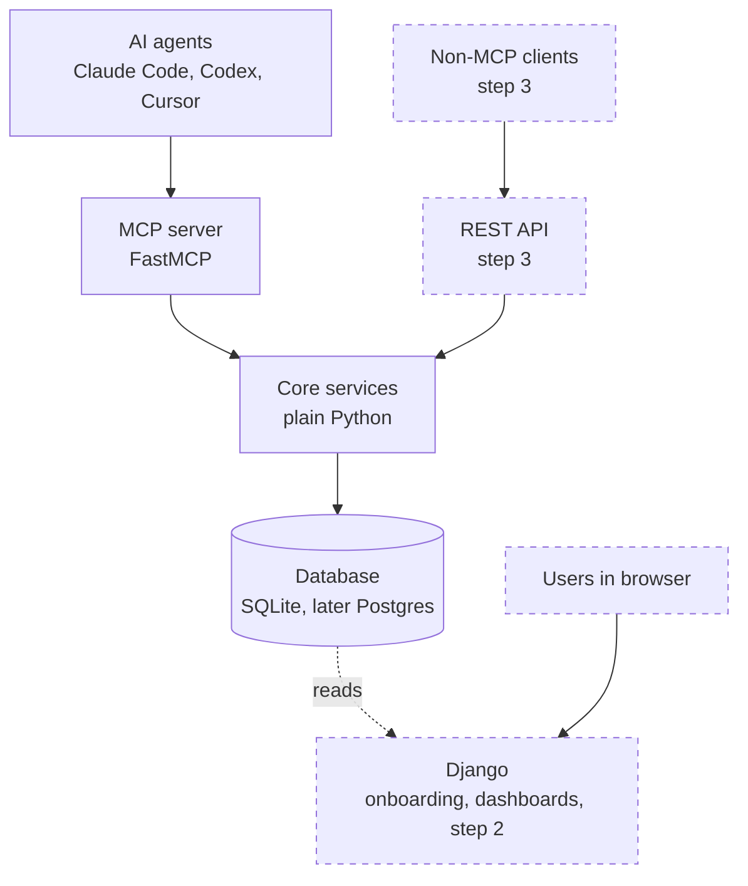

# contextkit

> Shared project context for every AI coding agent you use.

**Status:** Early development (step 1: single-user local MCP server)

---

## The problem

If you work with several AI tools (Claude Code, Codex, Cursor), every switch means writing a handoff document: what's built, what was decided and why, what's next, and what's blocking. Skip it, and the next agent re-asks questions, re-litigates decisions, or breaks conventions it didn't know about.

## The idea

contextkit is an [MCP](https://modelcontextprotocol.io) server that every agent connects to. Agents load project context when they start and record decisions and progress as they work. When you switch tools, the next agent picks up where the last one stopped. The handoff document still exists, but the agents maintain it continuously.

It's tool-neutral by design: your project's context belongs to you and is readable by any agent.

## How it works

### Context layers

| Layer | What it holds | How it changes |
|---|---|---|
| Stable | Stack, architecture, conventions, rules | Rarely |
| Decisions | What was decided and why | Appended |
| Current state | In progress, next steps, blockers | Overwritten |
| Sessions | Raw summaries of each work session | Appended, then compacted |

### A handoff

1. You're working in Claude Code. It records a decision with `log_decision` and, before stopping, calls `update_state` and `log_session`.
2. Core redacts secrets and saves everything to the database.
3. You open Codex in the same repo. It calls `get_context` and receives a briefing: conventions, key decisions, current state, and recent sessions.
4. Codex continues from where Claude Code stopped.

Projects are identified automatically from the git remote URL, falling back to the folder path.

## Architecture



- **MCP server:** a thin transport layer. It defines tools and calls core; it contains no business logic.
- **Core services:** a plain Python package with no Django dependency. It handles briefing assembly, compaction, redaction, and storage.
- **Database:** SQLite locally; Postgres once hosted.
- **Django (step 2):** onboarding, API keys, and analytics. It reads context tables but never writes them.

Only core writes to the context tables. See [`docs/adr/`](docs/adr/) for the full list of architecture decisions.

## MCP tools

| Tool | Purpose |
|---|---|
| `get_context` | Return the project briefing for the agent to load |
| `log_decision` | Record a decision and its reasoning |
| `update_state` | Replace the current state: progress, next steps, blockers |
| `log_session` | Append a summary of the work session |
| `export_markdown` | Export the project context as a readable markdown file |

## Repository structure

```
contextkit/
├── core/            # plain Python: schemas, services, storage
│   ├── schemas.py
│   ├── services.py
│   ├── briefing.py
│   ├── compaction.py
│   ├── redaction.py
│   └── storage.py
├── mcp_server/      # FastMCP server, imports core
├── backend/         # Django (step 2): onboarding and analytics
├── docs/
│   └── adr/         # architecture decision records
└── tests/
```

## Getting started

> These instructions describe the intended setup and will be finalized as step 1 is completed.

### Requirements

- Python 3.12+
- [uv](https://docs.astral.sh/uv/)

### Local development

```bash
git clone https://github.com/<your-username>/contextkit.git
cd contextkit
uv sync
uv run pytest
```

To test the tools interactively, use the MCP Inspector:

```bash
npx @modelcontextprotocol/inspector uv run python -m mcp_server
```

### Connecting agents

**Claude Code**

```bash
claude mcp add contextkit -- uv --directory /path/to/contextkit run python -m mcp_server
```

**Codex CLI** (`~/.codex/config.toml`)

```toml
[mcp_servers.contextkit]
command = "uv"
args = ["--directory", "/path/to/contextkit", "run", "python", "-m", "mcp_server"]
```

### Agent instructions

Add this to your project's `AGENTS.md` and `CLAUDE.md` so agents use contextkit consistently:

```markdown
## Project context
- At the start of every task, call `get_context` from the contextkit MCP server.
- When a meaningful decision is made, call `log_decision` with the reasoning.
- Before finishing, call `update_state` and `log_session`.
```

Local data is stored in `~/.contextkit/`.

## Privacy

Agent sessions can contain code, API keys, and customer data. contextkit redacts secrets before anything is stored or summarized, and in step 1 all data stays on your machine.

## License

To be decided.
