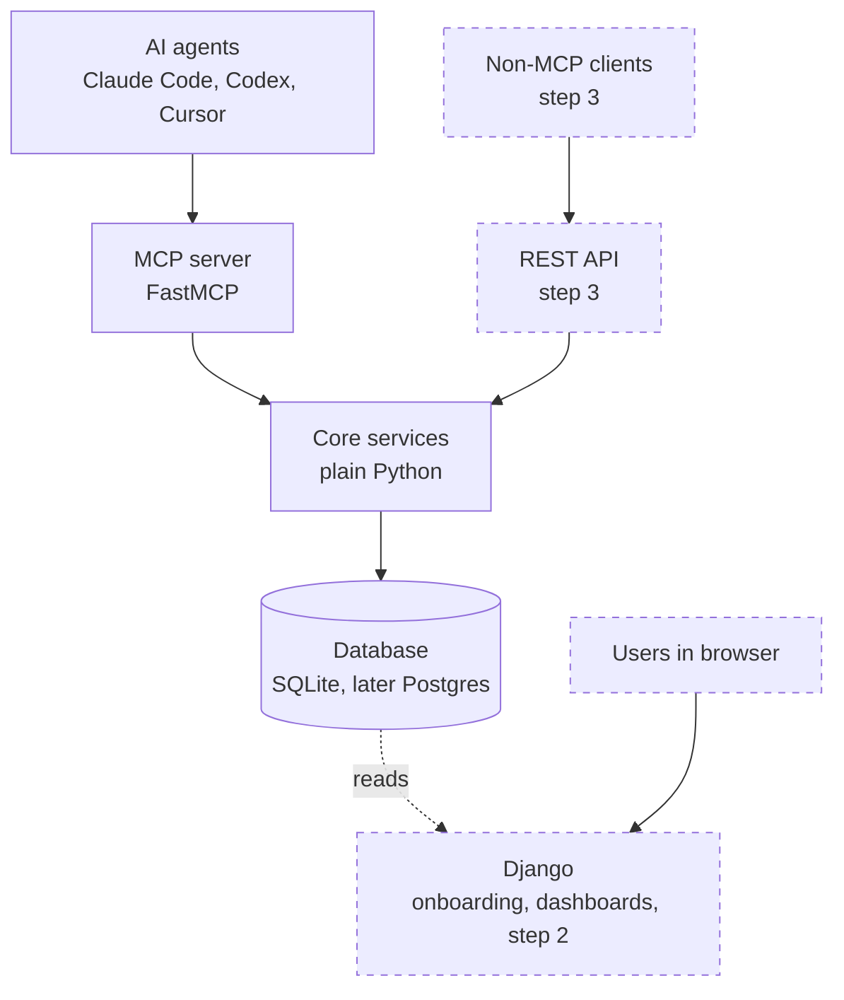

# contextkit

**AI-Powered Project Context Management**

> Seamlessly hand off work between AI coding agents without losing context, decisions, or progress.

---

## Why contextkit?

When you use multiple AI tools (Claude Code, Codex, Cursor) on the same project, switching between them means losing context. Each agent re-asks questions, revisits decisions, or breaks established conventions because it doesn't know what the last one did.

**contextkit solves this.** It's a unified context platform that every AI agent can read and write to, creating a continuous, shared understanding of your project. When you switch tools, the next agent picks up exactly where the last one left off—automatically.

### Features

✨ **Automatic Context Management** — Agents load full project briefings on startup, including architecture, decisions, progress, and blockers  
🔄 **Seamless Handoffs** — Switch between Claude Code, Codex, and Cursor with zero context loss  
🛡️ **Enterprise Security** — Automatic secret redaction, zero-knowledge architecture, all data stays local  
📊 **Persistent History** — Every decision and work session is recorded and searchable  
🔌 **Tool-Agnostic** — Works with any MCP-compatible AI coding agent  
⚡ **Zero Setup** — Install once, use everywhere—all agents automatically access the same context

## How It Works

### The Workflow

1. **Agent Starts** — Claude Code (or any MCP-compatible agent) connects to contextkit and calls `get_context`
2. **Context Loaded** — The agent receives a complete briefing: architecture, decisions made, current progress, known blockers, and recent work
3. **Agent Works** — As the agent makes progress, it automatically logs decisions (`log_decision`) and updates state (`update_state`)
4. **Session Ends** — Before finishing, the agent logs a session summary (`log_session`)
5. **Switch Tools** — Open Codex or Cursor on the same project
6. **Zero Context Loss** — The new agent loads the exact same context the previous agent had, plus everything that happened since

### What contextkit Remembers

| Layer | Contains | Updates |
|-------|----------|---------|
| **Stable Context** | Stack, architecture, conventions, rules | Rarely changed |
| **Decisions** | What was decided, why, alternatives considered | Continuously appended |
| **Current State** | Progress, next steps, blockers | Real-time updates |
| **Work Sessions** | Summary of each agent's work | Automatically logged |

### Security First

- **Automatic Redaction** — API keys, credentials, and sensitive data are redacted before storage
- **Zero Network Access** — All data stays on your machine (Step 1)
- **Open Source** — Fully auditable, no vendor lock-in

## Architecture



- **MCP server:** a thin transport layer. It defines tools and calls core; it contains no business logic.
- **Core services:** a plain Python package with no Django dependency. It handles briefing assembly, compaction, redaction, and storage.
- **Database:** SQLite locally; Postgres once hosted.
- **Django (step 2):** onboarding, API keys, and analytics. It reads context tables but never writes them.

Only core writes to the context tables. See [`docs/adr/`](docs/adr/) for the full list of architecture decisions.

## MCP tools

| Tool | Purpose |
|---|---|
| `get_context` | Return the project briefing for the agent to load |
| `log_decision` | Record a decision and its reasoning |
| `update_state` | Replace the current state: progress, next steps, blockers |
| `log_session` | Append a summary of the work session |
| `export_markdown` | Export the project context as a readable markdown file |

## Repository structure

```
contextkit/
├── core/            # plain Python: schemas, services, storage
│   ├── schemas.py
│   ├── services.py
│   ├── briefing.py
│   ├── compaction.py
│   ├── redaction.py
│   └── storage.py
├── mcp_server/      # FastMCP server, imports core
├── backend/         # Django (step 2): onboarding and analytics
├── docs/
│   └── adr/         # architecture decision records
└── tests/
```

## Installation

### Requirements

- Python 3.12+
- [uv](https://docs.astral.sh/uv/) (fast Python package manager)
- Git (for project detection)

### Quick Start

Clone and install contextkit:

```bash
git clone https://github.com/anthropics/contextkit.git
cd contextkit
uv sync
```

### Setup

#### For Claude Code

```bash
claude mcp add contextkit -- uv --directory /path/to/contextkit run python -m mcp_server
```

#### For Codex

Add to `~/.codex/config.toml`:

```toml
[mcp_servers.contextkit]
command = "uv"
args = ["--directory", "/path/to/contextkit", "run", "python", "-m", "mcp_server"]
```

#### For Cursor

Add to your Cursor settings:

```json
{
  "mcp_servers": {
    "contextkit": {
      "command": "uv",
      "args": ["--directory", "/path/to/contextkit", "run", "python", "-m", "mcp_server"]
    }
  }
}
```

### Verification

Test the server interactively using the MCP Inspector:

```bash
npx @modelcontextprotocol/inspector uv run python -m mcp_server
```

## Usage

### For AI Agents

Agents automatically use contextkit when configured. Add this to your project's `CLAUDE.md`:

```markdown
## Shared Context with contextkit

The project uses contextkit to maintain shared context across AI agents.

**At the start:** Call `get_context` to load the project briefing  
**When deciding:** Call `log_decision` with your reasoning  
**Before finishing:** Call `update_state` and `log_session`

This enables seamless handoffs between Claude Code, Codex, Cursor, and other agents.
```

### For Humans

View your project's context anytime:

```bash
# Export context as markdown
contextkit export --project /path/to/repo --output context.md
```

All data is stored in `~/.contextkit/` and stays on your machine.

## Privacy & Security

Your project context is sensitive. contextkit treats it that way:

- ✅ **Zero Cloud** — All data stays on your machine. No servers, no telemetry, no tracking
- ✅ **Automatic Redaction** — API keys, passwords, credentials redacted before storage
- ✅ **Open Source** — Fully auditable code. No hidden behavior
- ✅ **Git-Based** — Your context lives alongside your code, in version control

## Roadmap

**Current (v1.0)** — Single-agent local server, SQLite storage, 5 core tools

**v1.1** — Multi-agent support, session compaction, token budget management  
**v2.0** — Django backend, browser dashboard, PostgreSQL support  
**v2.1** — Team collaboration, API keys, usage analytics

## Contributing

We welcome contributions! See [CONTRIBUTING.md](CONTRIBUTING.md) for guidelines.

## Support

- 📖 **Documentation** — See [docs/](docs/) for detailed guides
- 🐛 **Issues** — Found a bug? [Open an issue](https://github.com/anthropics/contextkit/issues)
- 💬 **Discussions** — Questions? [Start a discussion](https://github.com/anthropics/contextkit/discussions)

## License

MIT License — See [LICENSE](LICENSE) for details.
