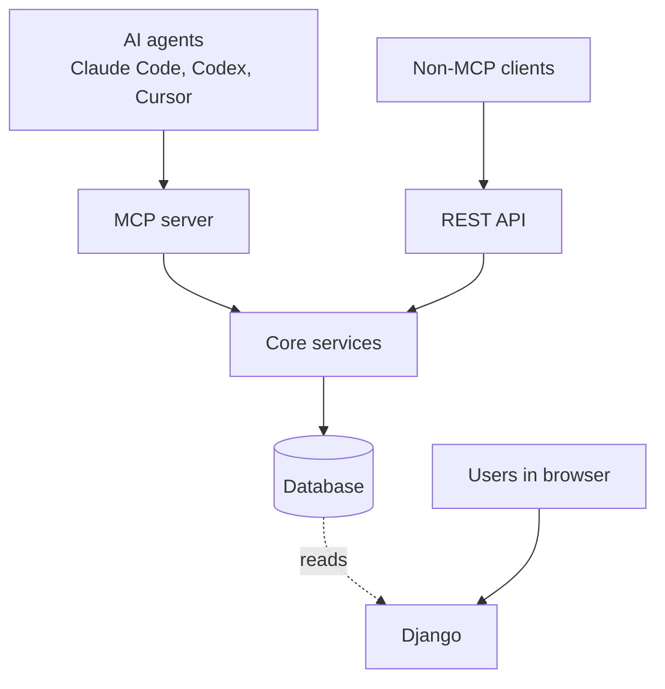
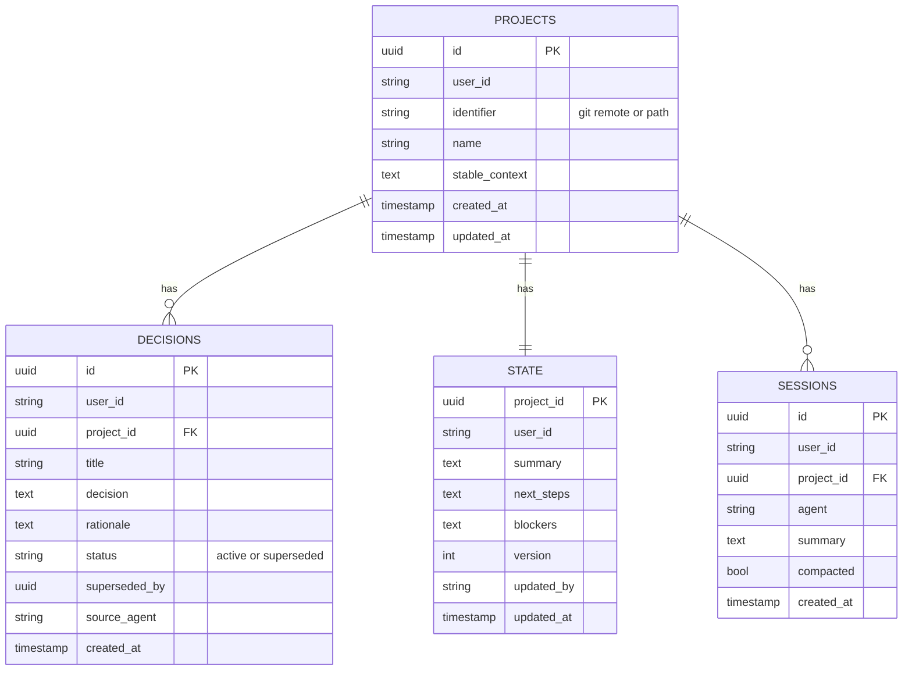
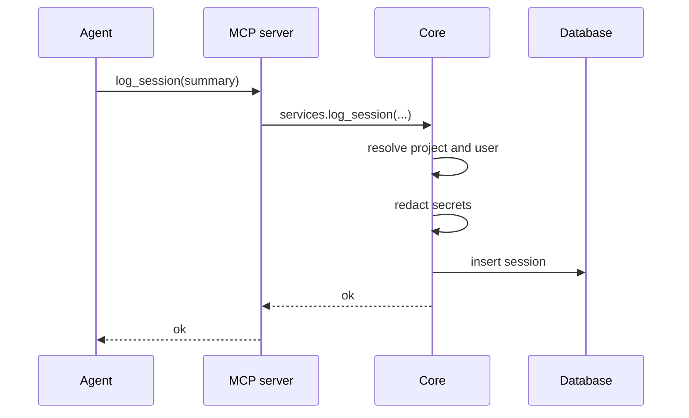
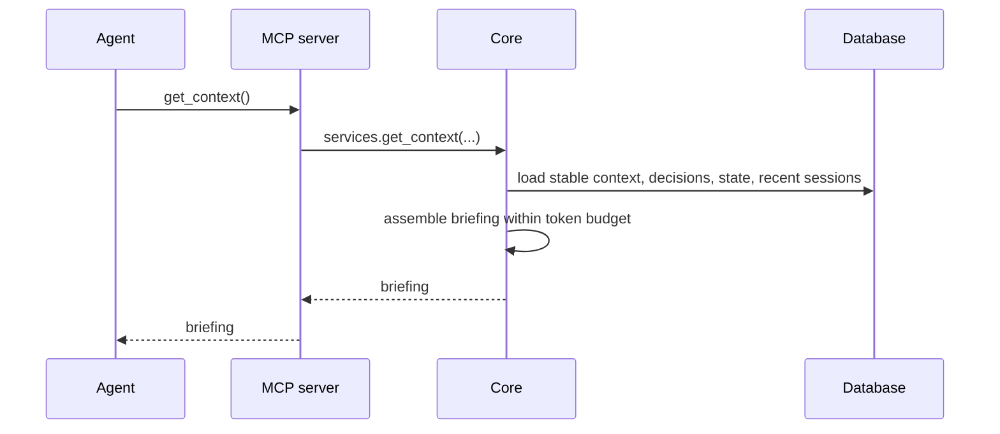

# Architecture

This document describes how contextkit is structured, how data moves through it, and the rules that keep its components separate. For individual decisions and their reasoning, see [`docs/adr/`](docs/adr/).

---

## Overview

contextkit has four components:

| Component | Technology | Responsibility |
|---|---|---|
| MCP server | Python, FastMCP | Exposes tools to AI agents; no business logic |
| Core services | Plain Python | All logic: briefing, compaction, redaction, storage |
| Database | SQLite locally, Postgres when hosted | Stores projects, decisions, state, and sessions |
| Django | Django | Onboarding, API keys, and analytics dashboards |



## Layering rules

These rules are what keep the system easy to extend. Changes that break them should be treated as architecture changes and recorded in an ADR.

1. **Transports are thin.** The MCP server and REST API validate input, call a core service function, and return its result. They contain no business logic.
2. **Core has no framework dependencies.** Core never imports Django or FastMCP. Any transport can call it, and it can be tested on its own.
3. **Only core writes context tables.** Projects, decisions, state, and sessions are written exclusively through core.
4. **Django never sits on the write path.** Agent requests never depend on Django being available. Django reads context tables for dashboards and writes only its own tables.
5. **MVT applies only to Django.** Core is a service layer and the MCP server is a transport; neither follows MVT.

## Repository layout

```
contextkit/
├── core/
│   ├── schemas.py       # Pydantic domain models and tool input schemas
│   ├── services.py      # Public functions called by every transport
│   ├── briefing.py      # Assembles get_context responses
│   ├── compaction.py    # Folds sessions into decisions and state
│   ├── redaction.py     # Removes secrets before storage
│   ├── identity.py      # Resolves the current project and user
│   └── storage.py       # Database access and sessions
├── mcp_server/          # FastMCP tool definitions
├── backend/             # Django project: onboarding, keys, analytics
├── docs/adr/
└── tests/
```

## Components

### MCP server

Defines the tools agents call. Each tool is a short function that forwards to `core.services`:

| Tool | Core function | Effect |
|---|---|---|
| `get_context` | `services.get_context` | Returns the project briefing |
| `log_decision` | `services.log_decision` | Appends a decision with its rationale |
| `update_state` | `services.update_state` | Replaces the current state |
| `log_session` | `services.log_session` | Appends a session summary |
| `export_markdown` | `services.export_markdown` | Renders the full context as markdown |

Locally, the server runs over stdio and each agent launches it as a subprocess. When hosted, it runs over streamable HTTP behind API key authentication.

### Core services

`services.py` is the only public interface of core. Every transport calls these functions and nothing else in core.

- **`briefing`** builds the `get_context` response from the stable context, active decisions, current state, and the most recent sessions, trimmed to a fixed token budget. When the budget is exceeded, older sessions are dropped first, then older decisions.
- **`compaction`** reads uncompacted sessions, uses an LLM to summarize them, and writes the results into the decisions and state layers. It runs asynchronously and never blocks an agent request.
- **`redaction`** removes API keys, tokens, passwords, and similar secrets from all text before it is stored or sent for summarization.
- **`identity`** determines which project a request belongs to, using the git remote URL and falling back to the folder path. It also supplies the `user_id`, which is fixed for single-user local use and comes from the API key when hosted.
- **`storage`** owns all database access. Switching from SQLite to Postgres is a configuration change here, not a code change elsewhere.

### Database

Holds the context tables owned by core, and, when hosted, the tables owned by Django. See [Data model](#data-model).

### Django

Handles sign-up, API key issuance, and analytics dashboards. It reads context tables through models declared with `managed = False`, so Django never creates or migrates them. The MCP server validates each hosted request against the API keys Django issues.

## Data model

All context tables carry a `user_id` and, except `projects`, a `project_id`.



- **Decisions** are never deleted. A reversed decision is marked `superseded` and points to its replacement, so the history of why things changed is preserved.
- **State** is one row per project and is overwritten on update. Its `version` column prevents two agents from silently overwriting each other (see [Concurrency](#concurrency)).
- **Sessions** are append-only. The `compacted` flag marks sessions that compaction has already processed. Compacted sessions are retained for now.
- **Full-text search** uses SQLite FTS5 over decisions and sessions, and Postgres full-text search when hosted.

## Data flows

### Write path



Writes are saved immediately in raw form. Nothing waits on summarization.

### Read path



### Compaction

1. A trigger fires: a session-count threshold, a schedule, or a manual request.
2. Core loads uncompacted sessions for the project.
3. The text, already redacted, is sent to the configured LLM for summarization.
4. Resulting decisions are appended, and the state is updated.
5. The processed sessions are marked `compacted`.

If compaction fails, the raw sessions remain untouched and are retried on the next trigger.

## Concurrency

Multiple agents can work on the same project at once.

- **Appends** to decisions and sessions never conflict.
- **State updates** use optimistic locking. `update_state` includes the `version` the agent last read; if the stored version has changed, the update is rejected and the agent receives the current state so it can merge and retry.
- **SQLite** permits one writer at a time, which is sufficient locally. The hosted deployment uses Postgres for concurrent writers.

## Deployment modes

### Local

```
Agents → MCP server (stdio) → Core → SQLite (~/.contextkit/)
```

Everything runs on the developer's machine. There is no Django, no authentication, and no network dependency except the LLM used for compaction.

### Hosted

```
Agents → MCP server (HTTP + API key) → Core → Postgres ← Django
Non-MCP clients → REST API → Core
```

The MCP server and REST API share the same core. Django runs as a separate service connected to the same Postgres database.

## Security and privacy

- Secrets are redacted before any text is stored or sent to an LLM.
- Local data never leaves the machine except for compaction requests to the configured LLM, which uses the user's own API key.
- In hosted mode, every record is scoped by `user_id`, and every request is authenticated with an API key.

## Extension points

| To add | Change |
|---|---|
| A new transport | Add a thin layer that calls `core.services` |
| A new tool | Add a function to `services.py`, then expose it in each transport |
| A new database | Add an engine configuration in `storage.py` |
| Semantic search | Add an embeddings column using `sqlite-vec` or `pgvector` |
| Transcript ingestion | Add a local watcher that submits summaries through `log_session` |