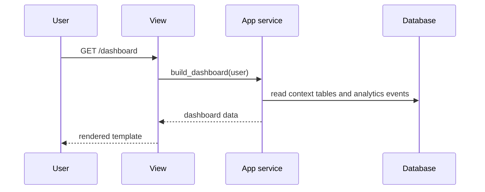

# Django backend architecture

The Django backend handles everything browser-facing: user sign-up, API key management, and analytics dashboards. It is not on the agent request path. Agents talk to the [MCP server](../mcp_server/ARCHITECTURE.md), which writes through [core](../core/ARCHITECTURE.md).

For the system-wide view, see the [root architecture document](../ARCHITECTURE.md).

---

## Responsibilities

- User sign-up, login, and account management
- Issuing, listing, and revoking API keys
- Onboarding: showing users how to connect their agents
- Analytics dashboards over projects, decisions, and sessions

## Constraints

- **Never writes context tables.** Projects, decisions, state, and sessions are read-only in Django.
- **Never on the write path.** If Django is down, agents keep working.
- **MVT throughout.** Models, views, and templates follow standard Django conventions, with business logic in each app's `services.py`, not in views or models.

## App layout

```
backend/
├── config/              # settings, urls, wsgi/asgi
└── apps/
    ├── accounts/        # users, authentication
    ├── api_keys/        # key issuance and revocation
    ├── onboarding/      # setup instructions and connection checks
    ├── context/         # read-only models over core's tables
    └── analytics/       # usage events and dashboards
```

Each app follows the same structure:

```
app/
├── models.py
├── services.py      # business logic
├── views.py         # thin: parse request, call service, render
├── urls.py
├── templates/
└── tests/
```

## Table ownership

| Owner | Tables | Django access |
|---|---|---|
| Django | users, API keys, analytics events | Read and write, migrated by Django |
| Core | projects, decisions, state, sessions | Read only, `managed = False` |

Read-only models declare the existing tables so the ORM can query them without creating or migrating them:

```python
class Decision(models.Model):
    id = models.UUIDField(primary_key=True)
    user_id = models.CharField(max_length=64)
    project = models.ForeignKey("Project", on_delete=models.DO_NOTHING)
    title = models.CharField(max_length=255)
    rationale = models.TextField()
    status = models.CharField(max_length=16)
    created_at = models.DateTimeField()

    class Meta:
        managed = False
        db_table = "decisions"
```

Core's Alembic migrations and Django's migrations are separate. When core changes a context table, the matching read-only model in `apps/context/` must be updated.

## Apps

### accounts

Uses Django's built-in authentication. The user's primary key becomes the `user_id` stored on every context record.

### api_keys

- A key is shown to the user once, at creation.
- Only a hash of the key is stored, along with its prefix for display, owner, creation time, last-used time, and revocation status.
- The MCP server validates incoming keys by hashing them and looking up this table. It only reads; Django remains the sole writer.

### onboarding

Walks new users through connecting Claude Code, Codex, and other agents: creating an API key, copying the MCP configuration for each agent, and adding the instruction snippet to `AGENTS.md` and `CLAUDE.md`. A connection check confirms the first successful tool call from the user's key.

### context

Holds the read-only models over core's tables. It contains no views of its own; other apps import these models.

### analytics

Records usage events and renders dashboards, such as:

- Active projects and last activity per project
- Sessions per agent over time
- Decisions logged and superseded
- Handoffs, meaning a session from one agent followed by `get_context` from a different agent

Dashboards read from the context tables and the analytics events table. Heavy queries should use aggregated tables rather than scanning sessions directly.

## Request flow



## Deployment

Django runs as its own service, connected to the same Postgres database as core. It shares no process with the MCP server, so either can be deployed, scaled, or restarted independently.

## Testing

- Service tests for each app using Django's test runner
- Read-only models tested against fixture data inserted directly into the context tables
- A check that API key hashing in Django matches validation in the MCP server