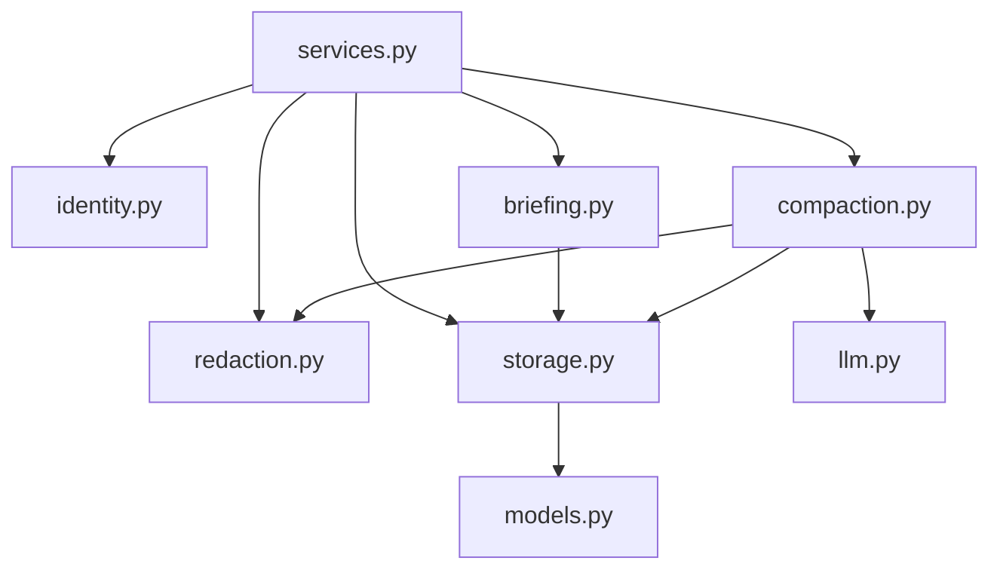

# Core services architecture

Core is a plain Python package that holds all of contextkit's logic. Every transport, including the MCP server and the REST API, calls into core, and core is the only component that writes context tables.

For the system-wide view, see the [root architecture document](../ARCHITECTURE.md).

---

## Responsibilities

- Resolve which project and user a request belongs to
- Redact secrets from all incoming text
- Store and read projects, decisions, state, and sessions
- Assemble briefings for `get_context`
- Compact sessions into decisions and state
- Export context as markdown

## Constraints

- **No framework imports.** Core never imports Django, FastMCP, or any web framework.
- **One public interface.** Transports call functions in `services.py` only. Everything else in core is internal.
- **Sole writer.** Core is the only code allowed to write context tables.
- **Transport-agnostic errors.** Core raises its own exception types; each transport maps them to its protocol.

## Module layout

```
core/
├── schemas.py       # Pydantic models: inputs, outputs, domain objects
├── services.py      # Public API
├── briefing.py      # Briefing assembly and token budgeting
├── compaction.py    # Session summarization
├── redaction.py     # Secret detection and removal
├── identity.py      # Project and user resolution
├── storage.py       # Engine, sessions, repositories
├── models.py        # SQLAlchemy table definitions
├── llm.py           # Summarization client (provider-agnostic)
├── config.py        # Settings from ~/.contextkit/ and environment
├── errors.py        # Core exception types
└── migrations/      # Alembic migrations for context tables
```



Dependencies point inward toward `storage.py` and `models.py`. Lower modules never import `services.py`.

## Public API

| Function | Input | Output |
|---|---|---|
| `get_context` | project hint, optional token budget | `Briefing` |
| `log_decision` | title, decision, rationale, optional `supersedes` | `Decision` |
| `update_state` | summary, next steps, blockers, expected version | `State` |
| `log_session` | agent name, summary | `Session` |
| `export_markdown` | project hint | markdown string |
| `run_compaction` | project hint | `CompactionResult` |

Every function accepts a `RequestContext` carrying the caller's `user_id` and project hint, so transports supply identity rather than core guessing it.

## Modules

### identity

Resolves a project from the project hint the transport provides:

1. If the hint includes a git remote URL, normalize it (strip protocol, credentials, and `.git`) and use it as the identifier.
2. Otherwise, use the absolute folder path.
3. If no project matches, create one.

The `user_id` comes from the `RequestContext`. Locally it is a fixed value from config; when hosted, the transport sets it from the authenticated API key.

### redaction

Runs on every text field before storage and before any text is sent to an LLM. It detects common secret formats such as API keys, bearer tokens, private keys, connection strings, and `.env`-style assignments, and replaces them with a placeholder like `[REDACTED:api_key]`. The detection approach, regex patterns or `detect-secrets`, is still an open ADR.

### briefing

Builds the `get_context` response in this order:

1. Stable context
2. Current state
3. Active decisions, newest first
4. Recent sessions, newest first

If the result exceeds the token budget, it drops the oldest sessions first, then the oldest decisions. Stable context and current state are never dropped. The briefing is returned as structured data, and transports decide how to render it.

### compaction

1. Load uncompacted sessions for a project.
2. Send them, with current state and recent decisions for reference, to the LLM through `llm.py`.
3. Parse the response into new decisions and an updated state.
4. In one transaction: insert decisions, update state, and mark sessions `compacted`.

A failure at any step rolls back the transaction, leaving sessions uncompacted for the next run. The trigger (session count, schedule, or manual) is configured, not hardcoded.

### llm

A small interface with a single `summarize` method, so the provider can change without touching compaction. The provider and model come from config and use the user's own API key.

### storage

Owns the SQLAlchemy engine, sessions, and repository functions for each table. The database URL comes from config:

- Local: `sqlite:///~/.contextkit/contextkit.db`
- Hosted: a Postgres URL

Full-text search uses FTS5 on SQLite and native full-text search on Postgres, behind the same repository function.

## Data model

| Table | Key columns | Write pattern |
|---|---|---|
| `projects` | `id`, `user_id`, `identifier`, `stable_context` | Created on first use, updated rarely |
| `decisions` | `id`, `project_id`, `rationale`, `status`, `superseded_by` | Append only; superseded, never deleted |
| `state` | `project_id`, `summary`, `next_steps`, `blockers`, `version` | One row per project, overwritten |
| `sessions` | `id`, `project_id`, `agent`, `summary`, `compacted` | Append only |

All tables include `user_id`. Migrations are managed with Alembic and live in `core/migrations/`.

## Concurrency

`update_state` requires the version the caller last read. If the stored version differs, core raises `StateConflict` containing the current state, and the caller merges and retries. Appends to decisions and sessions never conflict.

## Errors

| Exception | Meaning |
|---|---|
| `ValidationError` | Input failed schema validation |
| `ProjectNotFound` | The hint could not be resolved and creation is disabled |
| `StateConflict` | The state version changed since it was read |
| `CompactionFailed` | Summarization or parsing failed; nothing was written |

## Testing

- Unit tests for `redaction`, `briefing`, and `identity` with no database
- Repository and service tests against an in-memory SQLite database
- Compaction tests with a fake `llm` implementation, so tests make no network calls